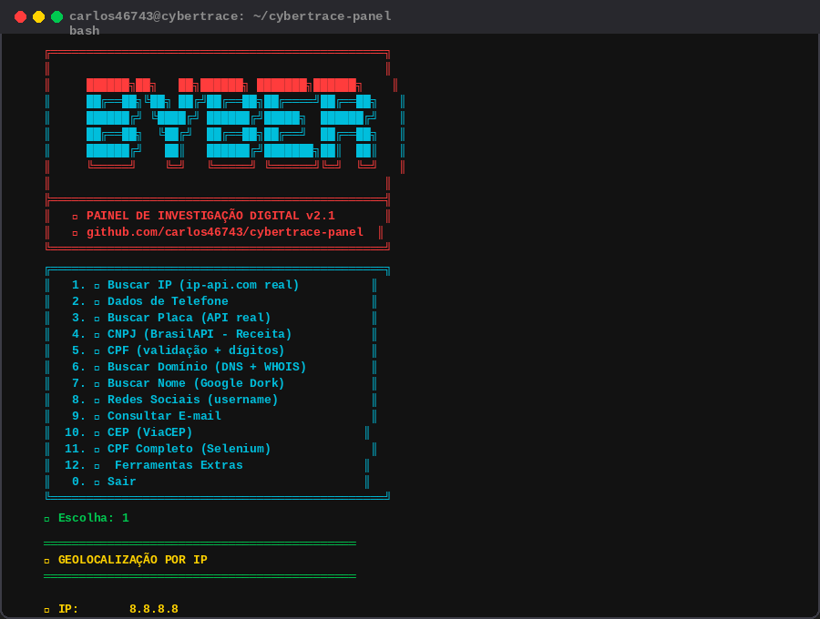

# 🔍 Cybertrace Panel v2.2

Painel de Investigação Digital com consultas a APIs públicas reais.



## Menu

```
 1. 📍 Buscar IP          (rua, bairro, CEP, DDD, ISP, ASN, proxy/VPN)
 2. 📱 Dados de Telefone   (DDD, operadora, região - TODOS os DDDs do Brasil)
 3. 🚗 Buscar Placa        (BrasilAPI/FIPE)
 4. 🆔 CNPJ                (BrasilAPI - Receita Federal)
 5. 📇 CPF                 (validação de dígitos + UF)
 6. 🌐 Buscar Domínio      (DNS + MX + NS + TXT + WHOIS)
 7. 🔍 Buscar Nome         (Google Dorking - 10+ plataformas)
 8. 👤 Redes Sociais       (26 plataformas + HTTP check)
 9. 📧 Consultar E-mail    (MX, NS, Gravatar, HIBP, Hunter.io)
10. 📮 CEP                 (ViaCEP - rua, bairro, cidade)
11. 🆔 CPF Completo        (Selenium - requer Chrome)
12. 🛠️ Ferramentas Extras  (12 utilitários)
```

### Ferramentas Extras (opção 12)

```
 1. 📊 Info do sistema      7. 🕵️ Verificar vazamento email
 2. 🧹 Limpar histórico     8. 🌦️ Previsão do tempo (wttr.in)
 3. 📡 Ping/Speedtest       9. 🔑 Gerador de senhas seguras
 4. 💡 QR Code             10. 🔐 Gerador de hash (MD5/SHA1/256/512)
 5. 🌙 Matrix Rain         11. 🔣 Base64 encode/decode
 6. 🔗 Encurtar URL        12. 🌐 Meu User-Agent
```

## Instalação Termux

```bash
pkg update && pkg upgrade -y
pkg install -y curl python3 git
git clone https://github.com/ClubeDoTermux/cybertrace-panel.git
cd cybertrace-panel
bash cybertrace.sh
```

## Instalação Linux (Debian/Ubuntu)

```bash
sudo apt update && sudo apt install -y curl python3 git dnsutils
git clone https://github.com/ClubeDoTermux/cybertrace-panel.git
cd cybertrace-panel
bash cybertrace.sh
```

## Uso via terminal (sem menu)

```bash
bash cybertrace.sh --help
bash cybertrace.sh --ip 8.8.8.8
bash cybertrace.sh --cnpj 00000000000191
bash cybertrace.sh --cep 01310000
bash cybertrace.sh --cpf 52998224725
bash cybertrace.sh --placa ABC1234
bash cybertrace.sh --dominio google.com
bash cybertrace.sh --telefone 5511999999999
bash cybertrace.sh --tempo "Sao+Paulo"
bash cybertrace.sh --redes username
bash cybertrace.sh --email user@example.com
```

## CPF Completo (opção 11)

Requer Chrome/Chromium + dependências Python:

```bash
pip install selenium webdriver-manager beautifulsoup4
bash cybertrace.sh
# Escolha a opção 11
```

## APIs utilizadas

| API | Dados | Grátis |
|-----|-------|--------|
| [ip-api.com](http://ip-api.com) | Geolocalização de IP + proxy/VPN/hosting | ✅ |
| [Nominatim/OSM](https://nominatim.openstreetmap.org) | Reverse geocoding: rua, bairro, CEP | ✅ |
| [BrasilAPI](https://brasilapi.com.br) | CNPJ (Receita Federal), FIPE (veículos) | ✅ |
| [ViaCEP](https://viacep.com.br) | CEP (rua, bairro, cidade) | ✅ |
| [situacao-cadastral.com](https://www.situacao-cadastral.com) | CPF completo (via Selenium) | ✅ |
| [wttr.in](https://wttr.in) | Previsão do tempo | ✅ |
| [TinyURL](https://tinyurl.com) | Encurtador de URL | ✅ |

## Novidades na v2.2

- 🛣️ **IP detalhado**: rua, número, bairro e CEP via reverse geocoding (OpenStreetMap)
- 🇧🇷 **ViaCEP integrado**: IPs brasileiros mostram logradouro oficial, complemento e DDD
- 🔁 **PTR/hostname reverso** e distrito na consulta de IP
- 📄 **Consulta de IP reescrita** em Python (`ip_consulta.py`) com fallbacks automáticos
- ⚠️ Aviso de localização aproximada (nível ISP) para evitar interpretação errada

## Novidades na v2.1

- 🔍 **Detecção de proxy/VPN** na consulta de IP
- 🌦️ **Previsão do tempo** via wttr.in
- 🔑 **Gerador de senhas seguras** (com/sem símbolos)
- 🔐 **Gerador de hash** (MD5, SHA1, SHA256, SHA512)
- 🔣 **Base64 encode/decode**
- 🌐 **User-Agent detection**
- 📋 **Registros DNS completos** (MX, NS, TXT, WHOIS)
- 📞 **Todos os DDDs do Brasil** mapeados na consulta telefone
- 🧹 **Código reestruturado** com timeout em todas requisições
- 📱 **Suporte melhorado** para Termux e Linux

## Aviso

Ferramenta para fins educacionais e consultas públicas. Dados pessoais (CPF completo, dono de veículo, telefone) são protegidos pela LGPD e não estão disponíveis em APIs públicas gratuitas.
